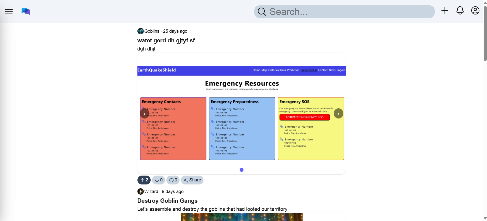
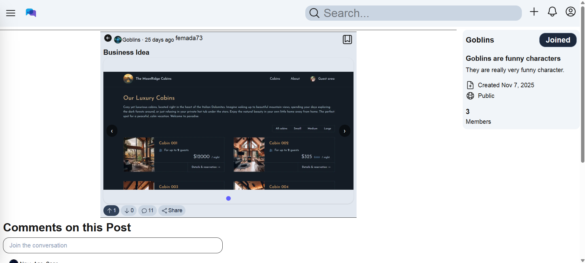
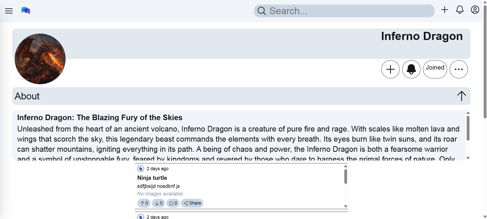
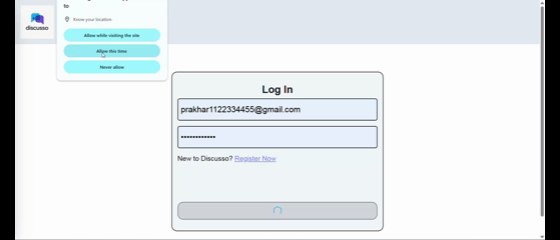

# Discusso: Where Conversations Find a Home

## TL;DR

Reddit-style discussion platform built with **Next.js + Supabase**, featuring JWT authentication, communities, posts with drafts, voting, comments, search, and a future ML layer for personalized feeds and semantic search.

## Overview

Discusso enables users to **create posts, join communities, vote, comment, and explore trending content**. Built with Next.js and Supabase with custom JWT auth, and future ML enhancements like content recommendations, toxicity detection, and semantic search.

## Preview

## Live Demo

## Core Features

**Authentication**

- JWT-based login, session retention, profile management

**Communities**

- Create, join, and explore communities

**Posts & Feeds**

- Markdown editor, media uploads, tags, drafts
- Dynamic feeds: Home, Popular, Explore

**Interactions**

- Upvote/downvote, comments, bookmarks

**Search**

- Posts & communities

**Gamification**

- Karma unlocks features

## App Flow

- **Guest**: browse content, search; login required to interact
- **User**: create posts/drafts, vote, comment, join communities
- **Admin (future)**: manage reports, moderation

## Tech Stack

- **Frontend & Backend**: Next.js + TailwindCSS
- **Database**: Supabase(Postgres)
- **Authentication**: Custom JWT (via Next.js API routes)
- **ML/DL Models**: HuggingFace/ PyTorch / Tesorflow (later integration)
- Deployment: Vercel

## System Architecture

Client (Next.js) --> Next.js API Routes --> Supabase DB/Storage
|
v
Future ML Microservices

## Folder Structure

- /app → Pages & App Router
- /\_components → Reusable components
- /\_hooks → Custom hooks
- /\_libs → API calls
- /\_context → Context API
- /utils → Utility functions
- /public → Static assets
- /\_tests → Test cases

## Development Roadmap

- **Phase 1**: UI Skeleton(Completed)
- **Phase 2**: Authentication & Profiles(Completed)
- **Phase 3**: Core Features (posts, communities, votes)(Completed)
- **Phase 4**: ML Features(Upcoming)

## How to Run Locally

1. Clone the project
2. Install dependencies  
   npm install

3. Create `.env.local` and add:

- SUPABASE_URL=your-url
- SUPABASE_ANON_KEY=your-anon-key
- SUPABASE_SERVICE_ROLE_KEY=service-role-key
- REFRESH_TOKEN_SECRET=your-secret
- ACCESS_TOKEN_SECRET=your-secret

⚠ Do NOT share your Supabase service role key.

4. Start the app  
   npm run dev

## Future Enhancements

- Realtime comments
- Live notifications
- Advanced ML models for ranking
- Community moderation tools
- Mobile app (React Native)

## License

This project is licensed under the MIT License.
See the LICENSE file for details.

## Project Link

https://discusso-gules.vercel.app/

## Author

**Prakhar Pathak**

- Email: prakharpathak192@gmail.com
- Portfolio: https://phantomsynth.com/
- LinkedIn: https://www.linkedin.com/in/prince-pandey-4a58031ba
- GitHub: https://github.com/octoprakhar
