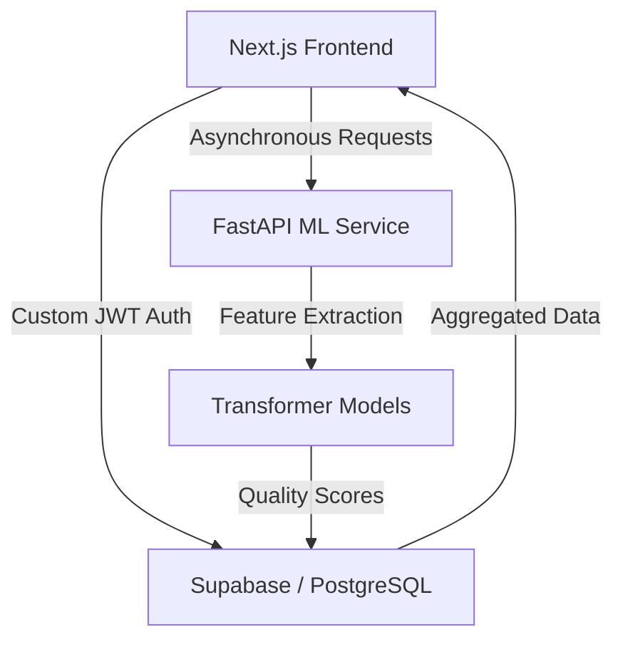

## 📌 Discusso — ML-Powered Discussion Platform


Discusso is a high-performance, full-stack discussion platform engineered to prioritize **substance over noise**. By integrating custom Machine Learning models into the ranking algorithm, Discusso evaluates content based on semantic quality, intellectual effort, and discussion potential rather than simple engagement metrics.


### 🔗 [Live Demo](https://discusso-gules.vercel.app/) | [Author Portfolio](https://phantomsynth.com/)

---

## 🏗️ System Architecture

Discusso is built as a microservice-oriented architecture to separate concerns between user interaction, data persistence, and heavy ML computation.


```mermaid
graph TD
    A[Next.js Frontend] -->|Custom JWT Auth| B[Supabase / PostgreSQL]
    A -->|Asynchronous Requests| C[FastAPI ML Service]
    C -->|Feature Extraction| D[Transformer Models]
    D -->|Quality Scores| B
    B -->|Aggregated Data| A
```

* **Frontend**: Next.js (App Router) with TailwindCSS for a responsive, stateful UI.
* **Database**: Supabase (PostgreSQL) utilizing RPCs and JSONB aggregation for optimized data retrieval.
* **ML Service**: FastAPI-based microservice handling semantic analysis and automated tagging.
* **DevOps**: Dockerized environment with a GitHub Actions CI/CD "Quality Gate."

---

## 🔄 App Logic & User Flow

Instead of a simple list, here is how the data and user state flow through the platform:

**1. Discovery Phase**
* **Guest**: Browses high-quality feeds ranked by the "Effort + Openness" algorithm.
* **Search**: Utilizes PostgreSQL text-search (with planned semantic search integration).

**2. Engagement Phase (Authenticated)**
* **Identity**: Hybrid session management (Access + Refresh tokens) via custom JWT logic.
* **Participation**: Users join communities, vote on content, and engage in threaded comments.

**3. Content Creation & ML Analysis**
* **Drafting**: Markdown-supported editor with local save states.
* **Processing**: On submission, the **ML Service** intercepts the post to calculate an **Effort Score** and an **Openness Score**.
* **Tagging**: NLP models automatically generate semantic tags (e.g., `Productivity`, `Work-from-home`) based on context.

---

## 🧠 The Intelligence Layer (ML Integration)

The core differentiator of Discusso is its ranking philosophy. We move away from "clickbait" by using a calculated quality score:

$postQuality = 2 \times Openness + Effort$

$score = postQuality + \tanh(UserKarma)$

* **Effort**: Measures the depth and structural complexity of the post.
* **Openness**: Evaluates the post's potential to trigger meaningful dialogue.
* **Karma Tie-breaker**: User reputation only influences the ranking as a secondary factor, ensuring new, high-quality voices are heard.

---

## 🧪 Engineering Excellence & Testing

To ensure reliability in a distributed environment, Discusso employs a multi-layered testing strategy:

* **End-to-End (E2E)**: Powered by **Playwright**. We simulate real user journeys, including login, community selection, and post creation with a wait-state for ML tag generation.
* **Unit Testing**: Jest handles component-level logic and utility functions.
* **CI/CD Pipeline**: 
    1.  Push to `main` triggers a GitHub Action.
    2.  Spins up a Docker Compose environment (Frontend + Backend).
    3.  Runs Playwright suite against the live containers.
    4.  **Quality Gate**: Only if tests pass is the new Frontend image pushed to Docker Hub.

---

## 🐳 Development & Deployment

### Run Locally (Docker)
```bash
# Clone the repository
git clone https://github.com/octoprakhar/Discusso.git

# Setup Environment Variables
# Create .env.local with SUPABASE_URL, SUPABASE_ANON_KEY, etc.

# Spin up the full stack
docker-compose up --build
```

### Tech Stack Summary
* **Frontend**: Next.js, TailwindCSS, Playwright
* **Backend**: FastAPI, PyTorch, Sentence-Transformers
* **Infrastructure**: Docker, GitHub Actions, Supabase, Vercel

---

## 🎯 Vision

To transform digital forums from "echo chambers of noise" into **hubs of thoughtful exchange**, where the quality of one's argument dictates their reach.

---

